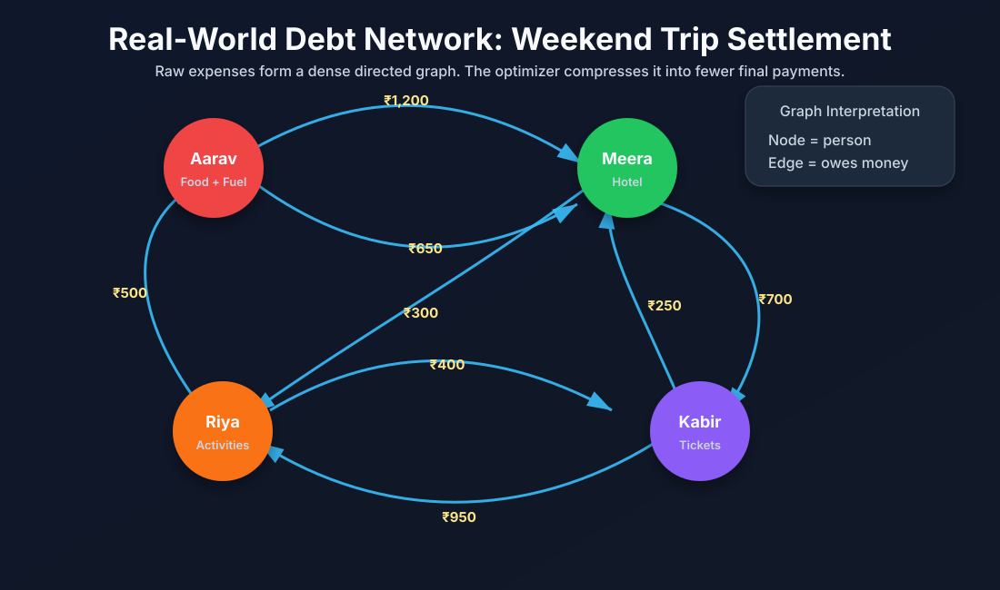
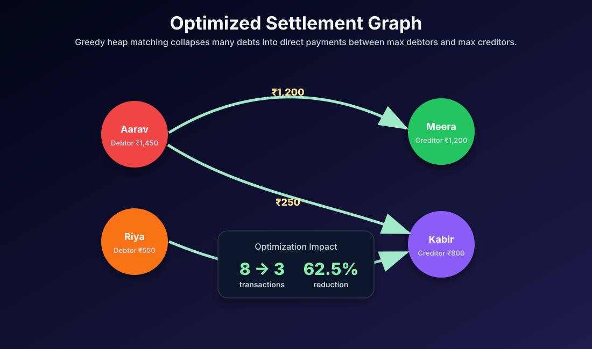
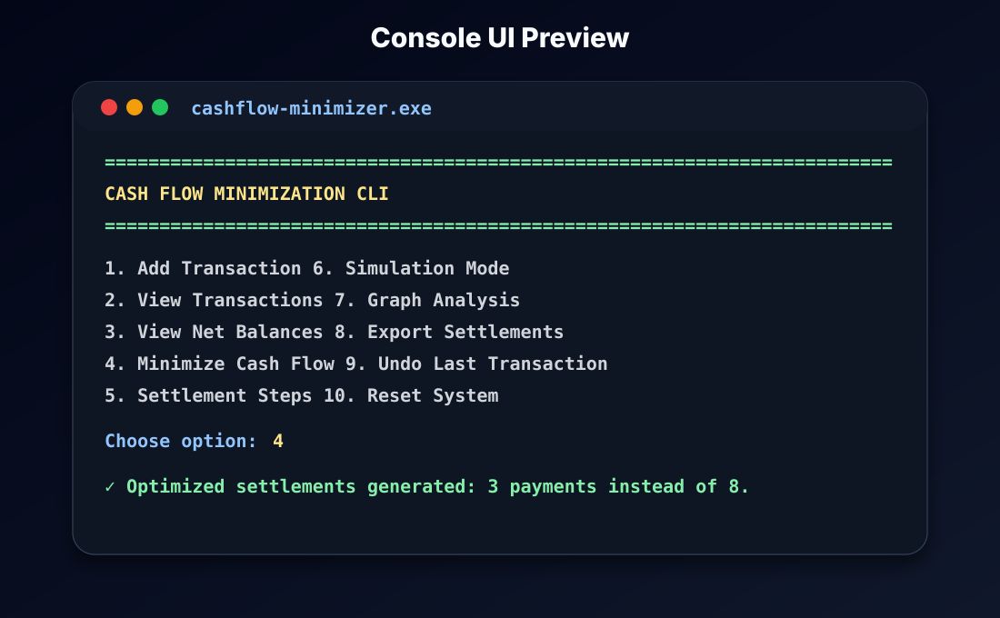
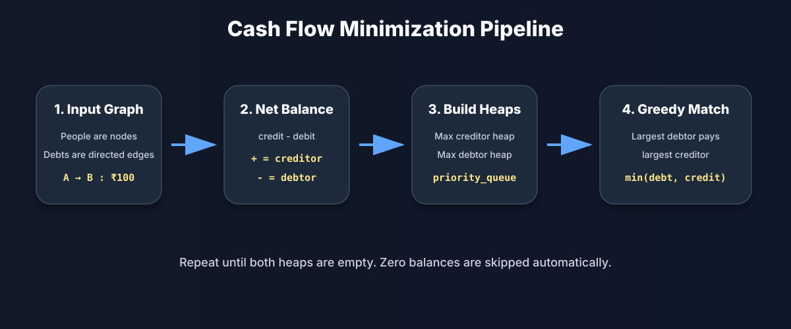

<div align="center">

# 💸 Smart Cash Flow Optimizer CLI

### A C++ graph-based debt settlement engine that converts messy real-world expenses into minimum optimized payments.


</div>

---

## 📌 Problem Statement

Imagine a weekend trip with friends, a college event, or a shared apartment where everyone pays for different things: hotel, food, tickets, fuel, and activities. By the end, the payment network becomes messy:

- Aarav owes Meera.
- Meera owes Kabir.
- Kabir owes Riya.
- Riya owes Aarav.
- Some people are both debtors and creditors at the same time.

Instead of settling every original debt one by one, this project computes each participant's **net balance** and generates the **minimum number of final settlement transactions**.

<p align="center">
  
</p>

---

## 🎯 Objective

The goal is to transform a dense directed debt graph into a compact settlement graph.

```text
Before optimization: many pairwise debts
After optimization : only essential payments remain
```

<p align="center">
  
</p>

---

## ✨ Key Features

- 🧾 Add, view, undo, reset, and export transactions
- 📊 Real-time net balance calculation
- ⚡ Greedy optimization using two `priority_queue` heaps
- 🧭 DFS/BFS graph traversal helpers
- 🔁 Circular debt detection such as `A → B → C → A`
- 🧩 Independent group counting for disconnected components
- 🖥️ Menu-driven console UI with structured output
- 🧪 Simulation mode: compare before vs after minimization
- 📉 Performance metrics: original transactions vs optimized settlements
- 🧼 Input validation for names, amounts, and menu choices

---

## 🖥️ Console Preview

<p align="center">
  
</p>

---

## 🧠 Core Idea

Every transaction is represented as a directed graph edge:

```text
A owes B ₹100
```

So the balance update becomes:

```text
A = A - 100
B = B + 100
```

After processing all transactions:

| Balance Type | Meaning |
|---|---|
| Negative | Person is a debtor |
| Positive | Person is a creditor |
| Zero | Person is already settled |

The optimizer ignores zero balances and directly matches the largest debtor with the largest creditor.

---

## ⚙️ Algorithm Pipeline

<p align="center">
  
</p>

### Step-by-step logic

1. Read all original transactions.
2. Build net balances for every participant.
3. Push creditors into a max-heap.
4. Push debtors into a max-heap based on absolute debt value.
5. Repeatedly match:
   - largest debtor
   - largest creditor
6. Settle the minimum possible amount between them.
7. Push remaining balance back into the respective heap.
8. Stop when both heaps are empty.

---

## 🧮 Greedy Strategy

At each iteration, the algorithm chooses the participant who owes the most and the participant who should receive the most.

```cpp
settledAmount = min(abs(maxDebtor.balance), maxCreditor.balance);
```

This works efficiently because each settlement fully clears at least one participant:

- The debtor becomes zero, or
- The creditor becomes zero, or
- Both become zero

That means every transaction reduces the active problem size.

---

## 🏗️ Project Architecture

```text
Cash-Flow-Minimizer/
│
├── main.cpp              # Application entry point
├── Models.h              # Transaction, Settlement, Result models
│
├── UI.h
├── UI.cpp                # Menu, input prompts, tables, CLI rendering
│
├── CashFlow.h
├── CashFlow.cpp          # Net balance + heap-based minimization logic
│
├── Graph.h
├── Graph.cpp             # DFS, BFS, cycle detection, components
│
├── Utils.h
├── Utils.cpp             # Validation, formatting, ANSI helpers
│
├── .vscode/
│   └── tasks.json        # VS Code build task
│
└── assets/
    ├── problem_graph.svg
    ├── optimized_settlement.svg
    ├── algorithm_pipeline.svg
    └── cli_preview.svg
```

---

## 🧩 Module Responsibilities

### `main.cpp`
Starts the application and delegates control to the console UI.

### `UI.cpp / UI.h`
Handles the user-facing layer:

- Menu rendering
- User input
- Tables and formatted output
- Step-by-step settlement display
- Simulation and export options

### `CashFlow.cpp / CashFlow.h`
Handles business logic:

- Transaction storage
- Undo stack
- Net balance calculation
- Greedy heap settlement
- Exporting final results

### `Graph.cpp / Graph.h`
Handles graph-related analysis:

- Adjacency list creation
- BFS traversal
- DFS traversal
- Circular debt detection
- Independent group counting

### `Utils.cpp / Utils.h`
Contains reusable utilities:

- Input validation
- Amount formatting
- Console separators
- ANSI color helpers

---

## 📥 Sample Input Scenario

```text
Aarav  -> Meera : ₹1200
Meera  -> Kabir : ₹700
Kabir  -> Riya  : ₹950
Riya   -> Aarav : ₹500
Aarav  -> Kabir : ₹650
Riya   -> Kabir : ₹400
Meera  -> Riya  : ₹300
Kabir  -> Meera : ₹250
```

---

## 📤 Optimized Output

```text
#     Payer        Receiver      Amount
-------------------------------------------
1     Aarav        Meera         ₹1200
2     Aarav        Kabir         ₹250
3     Riya         Kabir         ₹550

Transactions before optimization : 8
Transactions after optimization  : 3
Transactions reduced             : 5
Reduction percentage             : 62.50%
```

---

## 🔁 Circular Debt Example

```text
========================================================================
Cash Flow Minimization
========================================================================
1.  Add Transaction
2.  View All Transactions
3.  View Net Balances
4.  Minimize Cash Flow
5.  Show Settlement Steps
6.  Simulation Mode
7.  Graph Analysis
8.  Export Final Settlements
9.  Undo Last Transaction
10. Reset System
11. Exit
------------------------------------------------------------------------
Choose an option: 1

========================================================================
Add Transaction
========================================================================
Debtor name  : A
Creditor name: B
Amount owed  : 100
Transaction added successfully.

ID    Name                  Status               Balance
------------------------------------------------------------------------
0     A                     Owes                  100.00
1     B                     Receives              100.00
```

Sample Run

```text
A owes B ₹100
B owes C ₹50
C owes A ₹30
```

Net balances:

```text
A = -70
B = +50
C = +20
```

Optimized settlement:

```text
#     Payer             Receiver                  Amount
------------------------------------------------------------------------
1     A                 B                          50.00
2     A                 C                          20.00

Transactions before optimization : 3
Transactions after optimization  : 2
Transactions reduced             : 1
```

Step-by-step mode:

```text
Step 1: choose largest debtor A (owes 70.00) and largest creditor B (receives 50.00).
        Settle 50.00. Remaining debtor liability: 20.00, creditor claim: 0.00.
Step 2: choose largest debtor A (owes 20.00) and largest creditor C (receives 20.00).
        Settle 20.00. Remaining debtor liability: 0.00, creditor claim: 0.00.
```

```text
A pays B ₹50
A pays C ₹20
```

The circular chain is removed because the algorithm settles based on net balance instead of blindly preserving every original edge.

---

## 🧪 Edge Cases Handled

| Edge Case | Handling |
|---|---|
| Zero-balance participant | Ignored during heap settlement |
| Already settled system | Returns no settlement transactions |
| Circular debt | Reduced using net balance calculation |
| Duplicate transactions | Treated as valid separate records |
| Self-debt | Rejected by validation |
| Invalid amount | Re-prompted until valid input is given |
| Disconnected groups | Graph helper can count independent components |
| Large input | Heap-based approach keeps optimization efficient |

---

## ⏱️ Complexity Analysis

Let:

- `N` = number of participants
- `E` = number of original transactions
- `K` = number of non-zero-balance participants
- `T` = number of optimized settlement transactions

| Operation | Time Complexity | Space Complexity |
|---|---:|---:|
| Net balance calculation | `O(E)` | `O(N)` |
| Heap construction | `O(K log K)` | `O(K)` |
| Greedy settlement | `O(T log K)` | `O(T)` |
| DFS / BFS traversal | `O(N + E)` | `O(N + E)` |
| Cycle detection | `O(N + E)` | `O(N)` |

Overall settlement complexity:

```text
O(E + K log K + T log K)
```

---

## 🆚 Naive vs Optimized Approach

| Approach | Behavior | Drawback / Benefit |
|---|---|---|
| Naive settlement | Preserve original debt edges | May require many unnecessary payments |
| Net balance approach | Collapse all incoming/outgoing money | Removes redundant cycles |
| Heap-based greedy | Match largest debtor with largest creditor | Efficient and easy to explain in interviews |

---

## 🚀 Build and Run

### Using VS Code

1. Install a C++ compiler such as `g++` through MinGW-w64.
2. Make sure `g++` is available in your system PATH.
3. Open the project folder in VS Code.
4. Press:

```text
Ctrl + Shift + B
```

5. Run the generated executable.

```powershell
.\cashflow.exe
```

### Using Terminal

```bash
g++ -std=c++17 -Wall -Wextra -O2 main.cpp UI.cpp CashFlow.cpp Graph.cpp Utils.cpp -o cashflow
./cashflow
```

For Windows PowerShell:

```powershell
g++ -std=c++17 -Wall -Wextra -O2 main.cpp UI.cpp CashFlow.cpp Graph.cpp Utils.cpp -o cashflow.exe
.\cashflow.exe
```

---

## 🧭 Menu Options

```text
1.  Add Transaction
2.  View All Transactions
3.  View Net Balances
4.  Minimize Cash Flow
5.  Show Settlement Steps
6.  Simulation Mode
7.  Graph Analysis
8.  Export Final Settlements
9.  Undo Last Transaction
10. Reset System
11. Exit
```

---

## 📄 Export Format

The application can export final settlements to a text file:

```text
settlements.txt
```

Example:

```text
Final Optimized Settlements
-------------------------------------------
Aarav pays Meera ₹1200
Aarav pays Kabir ₹250
Riya pays Kabir ₹550
```

---

## 💼 Why This Project Is Interview-Friendly

This project demonstrates:

- Graph modeling
- Greedy algorithms
- Priority queues / heaps
- DFS and BFS traversal
- Cycle detection
- Modular C++ design
- Console UI/UX
- Real-world financial problem solving
- Clean separation of concerns

---

## 🔮 Future Enhancements

- JSON or CSV import/export
- Unit tests using GoogleTest
- Persistent transaction database
- GUI version using Qt
- Web dashboard version
- Multi-currency support
- Payment-mode constraints such as UPI, card, wallet, bank transfer
- Weighted settlement preferences based on transaction limits or trust score

---

## 📚 Learning Outcomes

After building this project, you will understand:

- How to convert real-world debt relationships into a graph
- Why net balance removes redundant circular payments
- How heaps improve greedy selection efficiency
- How to design modular C++ applications
- How to present an algorithmic project professionally on GitHub

---

<div align="center">

### ⭐ If this project helped you learn graph optimization and greedy algorithms, consider starring the repository.

</div>
